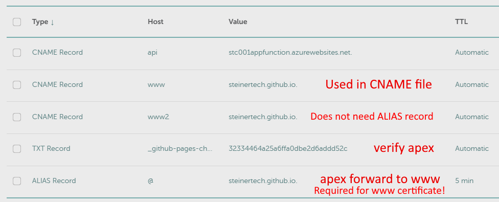

# GitHub Pages

## Custom Domain (Third level www.example.com)

* https://github.com/steinertech/GitHubPages (Code repo)

* https://steinertech.github.io/GitHubPages (Web Page)

* https://github.com/settings/pages (Verify apex example.com)

* https://github.com/steinertech/GitHubPages/settings/pages (www.example.com and click Save. Creates a CNAME file in repo)

* https://github.com/steinertech/GitHubPages/actions (Build after CNAME file change)

